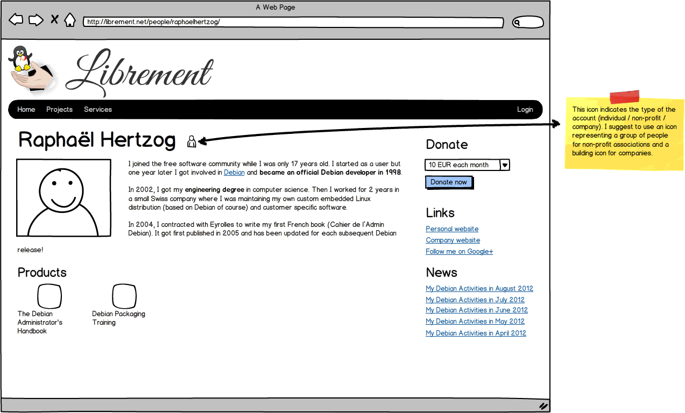

Account management and public profiles
======================================

.. _spec-std-account:

Standard account management
---------------------------

#. Users can create an account with email + password (confirmation by email
   required).

   #. Required fields: country / first name / last name / type of account
      (individual, company, non-profit) / organization name (required only
      company/non-profit accounts)
   #. Optional field: address / zip-code / city / state / phone

#. Users can attach multiple (confirmed) email addresses to a single
   account.
#. Users can login with an email + their password.
#. Users can recover a lost password (by giving their email).

Advanced account management
---------------------------

.. note:: To be specified.

.. _spec-basic-profile:

Basic public profile
--------------------

Users should be able to activate a public profile where they can fill all
those fields:

1. Display name (only required field, defaults to first + last name for
   individuals, and to organization name for others)
2. Unique account name (slug to be used in URLs, derived from display name
   by default with accented characters dropped and spaces replaced by a
   dash)
3. Picture
4. Bio
5. Multiple URLs (Website, Blog, Social accounts, etc.)
6. RSS feed

The public profile should be visible from ``/people/<user-slug>/``. The
RSS feed is turned into a 5 item News section with links. The other fields
are displayed directly.

Here's a mockup of how it could look like:

Advanced public profile
-----------------------

.. note:: To be specified.
